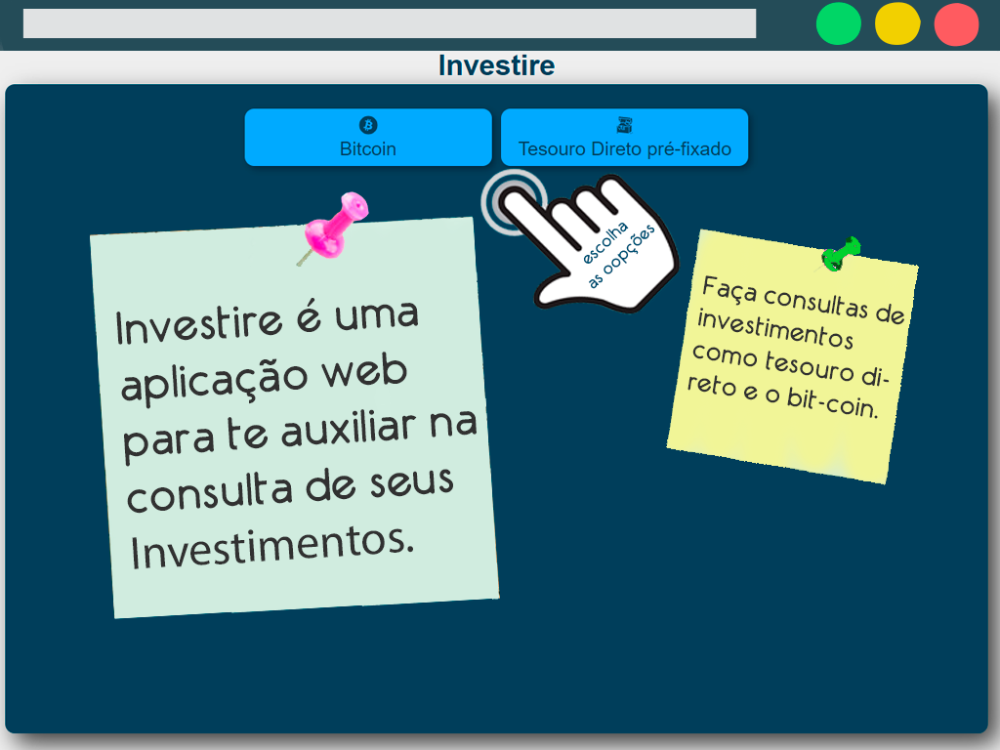
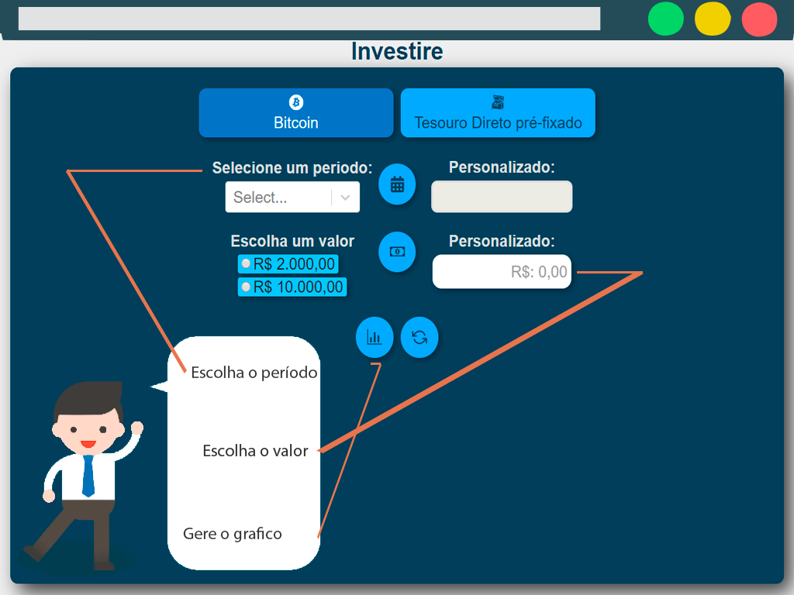

Este projeto foi desenvolvido com o [ReactJs](https://github.com/facebook/create-react-app).

## Investire

Investire e uma aplicação que calcula seu tipo de investimento dentre eles bit-coin ou tesouro direto  préfixado a 10% a.a selecionado, passando um período e o valor digitado ou selecionado que sera  seu capital inicial inicial como ilustram as imagens
  
## Iniciar o projeto utilize
com o terminal, cmd ou powershell, utilize o código 
### 1º `yarn` ou `npm install`
#### 2º `yarn start`

A aplicação iniciara neste endereço você pode acessa-lo no seu navegador Acesse: [http://localhost:3000](http://localhost:3000) . 
